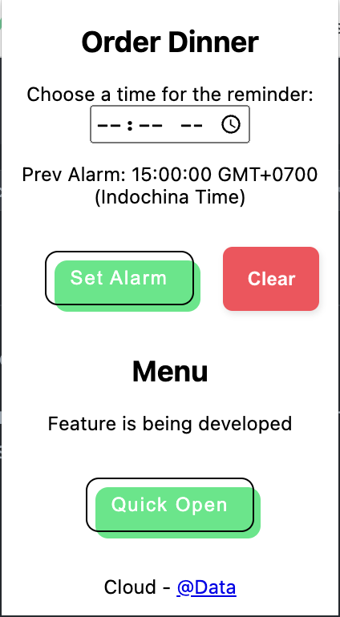

## Where is my dinner?

Hi Fossil-Cloud gangs!

> Have you ever forgotten to order your dinner? "Check this extension 🤟" : "Just go"

This extension will remind you to do that. Some features haven't been implemented yet so feel free to make some PR.

---

**Features**

- Set reminder time whenever you want the notification pops out.

- `lastChanceToOrder` is backup event that will be triggered 5 mins before the Order Forms closes. Just make sure you don't miss anything. If you click on the first notification, this event will trigger the second notification. Otherwise, it will force open the Order Forms.

- Clear the existed alarms.

- Quick open Order Forms (to confirm your choice or something else).
  
  

**Not fulfilled**

- Automation. Because currently, I cannot get REST API to send request to submit answer to Google Forms. And Google restricts those acts.

**How to install**

- Navigate to `chrome://extensions`
- Expand the Developer dropdown menu and click “Load Unpacked Extension”
- Navigate to the local folder containing the extension’s code and click Ok

**Demo**

